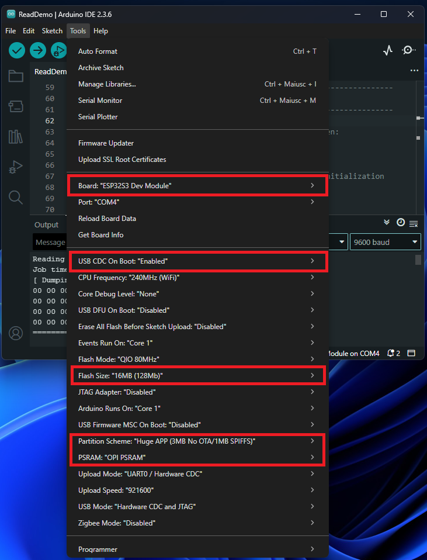

# Settimino OFFICIAL (Latest : 2.1.0)

This is the **official** Settimino repository starting with release 2.0.1.

Previous releases are available in the <a href="https://sourceforge.net/projects/settimino/files/" target="_blank">SourceForge</a> repository.

The official site is still <a href="https://settimino.sourceforge.net/" target="_blank">here</a>, where you can find a lot of info.

---
## News for 2.1.0

* Arduino GIGA R1 WIFI with Ethernet Shield 2
* Arduino Portenta H7 with Portenta Hat Carrier
* Waveshare ESP32-S3-ETH


## Arduino GIGA R1 WIFI

before everything, in platform.h select **GIGA_R1_LAN** as follows

```cpp
//#define ARDUINO_LAN    
//#define ESP8266_FAMILY  
//#define ESP32_WIFI
//#define M5STACK_WIFI
//#define M5STACK_LAN
//#define PORTENTA
#define GIGA_R1_LAN
//#define ESP32_S3_ETH
```

## Arduino Portenta

before everything, in platform.h select **PORTENTA** as follows

```cpp
//#define ARDUINO_LAN    
//#define ESP8266_FAMILY  
//#define ESP32_WIFI
//#define M5STACK_WIFI
//#define M5STACK_LAN
#define PORTENTA
//#define GIGA_R1_LAN
//#define ESP32_S3_ETH
```

## Waveshare ESP32-S3-ETH

https://www.waveshare.com/wiki/ESP32-S3-ETH

before everything, in platform.h select **ESP32_S3_ETH** as follows

```cpp
//#define ARDUINO_LAN    
//#define ESP8266_FAMILY  
//#define ESP32_WIFI
//#define M5STACK_WIFI
//#define M5STACK_LAN
//#define PORTENTA
//#define GIGA_R1_LAN
#define ESP32_S3_ETH
```
then, connect the board with the USB-C cable and follow this configuration:




